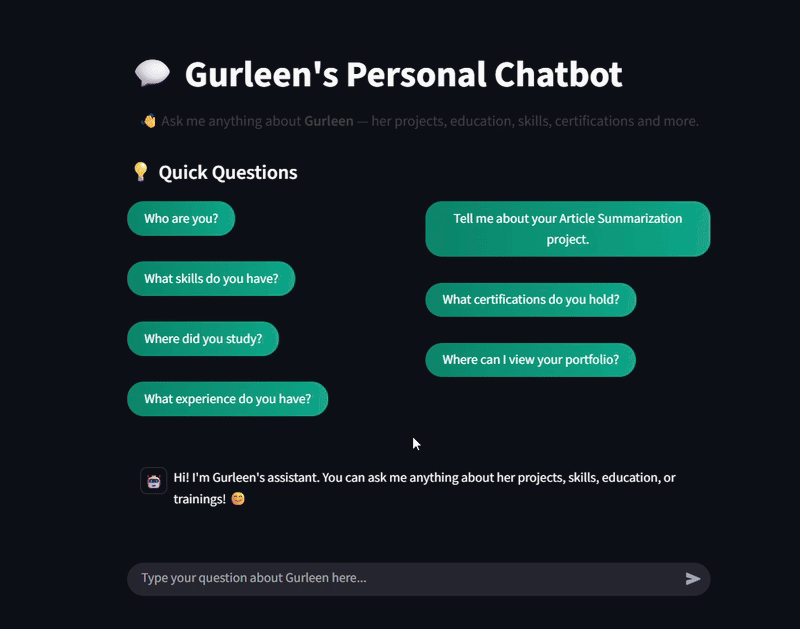

<h1 align="center">Hi 👋, I'm Gurleen Kaur Bali</h1>
<h3 align="center">✨ AI | Data | Full Stack ✨</h3>
<h4 align="center">Exploring, building, and learning in the world of intelligent systems 🌍</h4>

---

## 🧠 About Me
🎓 Graduate from Guru Gobind Singh Indraprastha University  
💡 Oracle Certified Generative AI Professional  
💻 Passionate about **AI, Data Science, and Creative Web Projects**  
🌱 Currently exploring **AI** and **Data** 
🚀 Always excited to bring data-driven ideas to life!

---

## 💡 Skills & Technologies

  
  
  
  
  
  
  
  
  
  
  
  
  

---

## 🎯 Featured Projects

### 🧭 [IPCheck — Suspicious IP Tracker](https://ipcheck-nine.vercel.app)
🔹 **Tech:** FastAPI, React, Random Forest, GeoIP  
🔹 An AI-powered dashboard that detects and visualizes suspicious IP addresses on a world map.

  
  

---

### 💬 [Personal Chatbot](https://gurleenchatbot.streamlit.app/)
🔹 **Tech:** FAISS, Hugging Face, Streamlit  
🔹 A personalized RAG + llm based that answers questions about me.

  

---

### 🌐 [My Portfolio](https://gurleenkaurbali19.github.io/)
🔹 Showcases my journey, projects, and certifications in a modern UI style.  
🔹 Built with **HTML, Tailwind CSS, and subtle animations** for a designer-inspired feel.

---

## 🧾 Certifications
🏅 Oracle Cloud Infrastructure – Generative AI Professional  
🏅 Generative AI (Microsoft + LinkedIn)  
🏅 Data Science Job Simulation – British Airways (Forage)

---

## Connect with Me!

---

> “Data is the new oil — and I’m learning how to refine it every day.” 🚀
