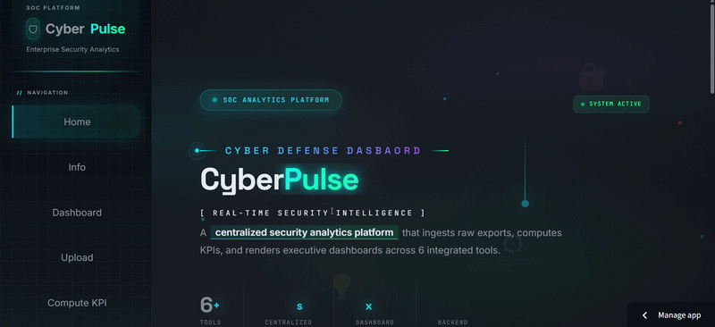
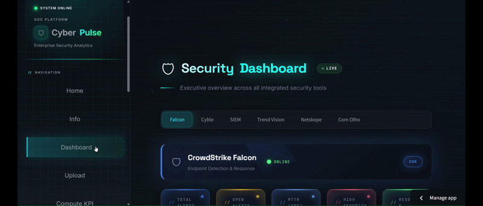
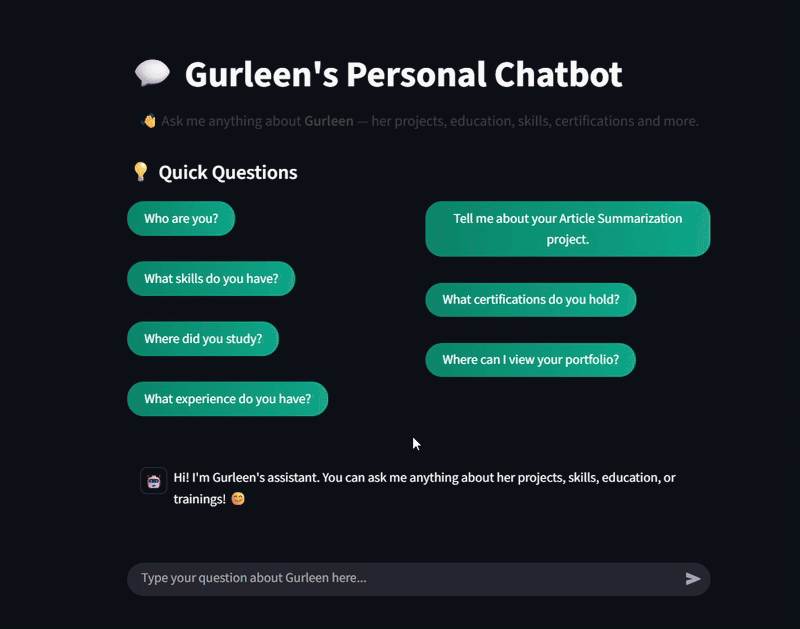

<h1 align="center">Hi 👋, I'm Gurleen Kaur Bali</h1>
<h4 align="center">Building intelligent systems at the intersection of AI, data engineering, and security 🌍</h4>

  
  
  

---

## 🧠 About Me

🎓 Graduate from Guru Gobind Singh Indraprastha University  
💡 Oracle Certified **Generative AI Professional**  
🛡️ Currently working as **IT Trainee @ Max Healthcare**      
💻 Passionate about **AI, Data Engineering, Cybersecurity Analytics, and Full Stack Development**  
🚀 Always excited to turn data into decisions!

---

## 💡 Skills & Technologies

  
  
  
  
  
  
  
  
  
  
  
  
  
  
  
  

---

## 🎯 Featured Projects

---

### 🛡️ [CyberPulse — Security Operations Analytics Platform](https://cyberrpulse.streamlit.app/)

🔹 **Tech:** Python · Streamlit · MySQL · Plotly · Pandas · Aiven  
🔹 Full-stack SOC analytics platform centralizing data from **6 security tools** — CrowdStrike Falcon, Cyble, SIEM, Trend Vision, Netskope & Com Olho — into a single KPI dashboard.

**Highlights:**
- 🗄️ 3-layer MySQL architecture with `kpi_master` as single source of truth
- 🔐 SHA-256 duplicate detection + full upload audit trail
- 📊 Interactive dark-theme dashboard with donuts, gauges, funnels, treemaps & area trends
- ☁️ Deployed on Streamlit Cloud + Aiven-hosted MySQL

  
  

---

### 🧭 [IPCheck — Suspicious IP Tracker](https://ipcheck-nine.vercel.app)

🔹 **Tech:** FastAPI · React · Random Forest · GeoIP  
🔹 AI-powered dashboard that detects and visualizes suspicious IP addresses on a world map.

  
  

---

### 💬 [Personal Chatbot](https://gurleenchatbot.streamlit.app/)

🔹 **Tech:** FAISS · Hugging Face · Streamlit  
🔹 A personalized RAG + LLM based chatbot that answers questions about me.

  

---

### 🌐 [My Portfolio](https://gurleenkaurbali19.github.io/gurleen_kaur_bali_portfolio/)

🔹 Showcases my journey, projects, and certifications in a modern UI.  
🔹 Built with **HTML, Tailwind CSS, and subtle animations**.

---

## 🧾 Certifications

🏅 Oracle Cloud Infrastructure — **Generative AI Professional**  
🏅 Generative AI — Microsoft + LinkedIn  
🏅 Data Science Job Simulation — British Airways (Forage)  
🏅 Software Engineering Simulation — J.P. Morgan (Forage)  
🏅 Python for Machine Learning — Great Learning  
🏅 Intro to AWS Cloud Careers — AWS

---

> *"Data is the new oil — and I'm learning how to refine it every day."* 🚀
